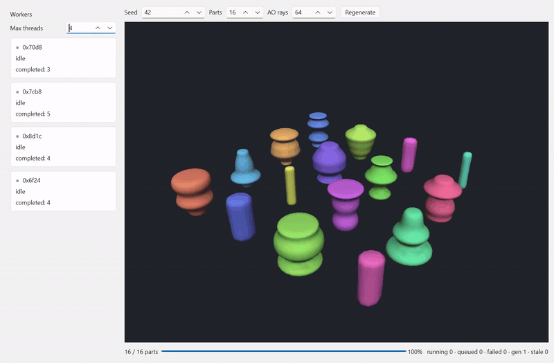

# Ordo

A small, typed-event application framework for C++20. An event is a plain
struct: the type is the identity, the fields are the payload. No string
notification names, no enums, no `void*`.

Discipline is enforced by types, not by convention. Each role talks to the
kernel through a context that carries only that role's capabilities — an
`Agent` cannot subscribe, because its context has no `subscribe`.

## The whole loop

```cpp
// Events — plain structs. Intents request; facts report.
struct AddTaskRequested { std::string title; };
struct TaskAdded        { std::uint64_t id; std::string title; };

struct Task { std::uint64_t id; std::string title; };

// Agent — owns the state and applies every mutation. Its context can send
// facts; it cannot subscribe.
class TaskList : public ordo::core::Agent {
public:
    static constexpr const char* kName = "tasks";
    TaskList() : Agent(kName) {}
    void add(std::string title) {
        const auto id = nextId_++;
        tasks_.push_back({id, title});
        context().send(TaskAdded{id, std::move(title)});
    }
private:
    std::uint64_t nextId_ = 1;
    std::vector<Task> tasks_;
};

// Command — policy. Decides the write, then tells the agent; created fresh
// per dispatch.
class AddTaskCommand : public ordo::core::Command<AddTaskRequested> {
public:
    void execute(const AddTaskRequested& e, ordo::core::CommandContext& ctx) override {
        if (e.title.empty()) return;               // rejected: no mutation, no fact
        ctx.agentAs<TaskList>(TaskList::kName)->add(e.title);
    }
};

// Presenter — Qt adapter. Sends intents, subscribes to facts.
void TaskListPresenter::onRegister() {
    subscribe<TaskAdded>(&TaskListPresenter::onTaskAdded);
}
void TaskListPresenter::onAddClicked(const QString& title) {
    context().send(AddTaskRequested{title.toStdString()});
}
void TaskListPresenter::onTaskAdded(const TaskAdded& e) {
    listWidget_->addItem(QString::fromStdString(e.title));
}

// Bootstrap — the only place the kernel itself appears.
ordo::core::Kernel kernel;
kernel.registerAgent(std::make_shared<TaskList>());
kernel.registerCommand<AddTaskRequested, AddTaskCommand>();
ordo::qt::ViewHost host(kernel);
host.add<TaskListPresenter>(listWidget);
```

Typo an event type and it fails to compile. Add a second subscriber to
`TaskAdded` — a counter, a badge, a tray icon — and no existing code
changes. The compiling version of this Presenter-shaped loop is
[`examples/task-list-clean/`](examples/task-list-clean); the ViewModel
variant of the same feature is
[`examples/task-list-mvvm/`](examples/task-list-mvvm). The full walkthrough
is [docs/usage-guide.md](docs/usage-guide.md).

## What does it solve?

**Stringly-typed events.**
Observer buses keyed by name — `"taskAdded"` — mean a typo at the send site
is a silent no-op at runtime, and the receive site casts a `void*` or
unpacks a variant. In Ordo the event *type* is the subscription key: the
typo is a compile error, and the payload arrives already typed.

**The everything-object.**
Native codebases lean on singletons — a global document, a global service
registry, managers reachable from anywhere. Each one is an invisible
dependency and an undeclared write path. Ordo's kernel is a plain object —
one per document, several can coexist — and no role ever holds it. Each
role gets a capability-scoped context instead, so what a role may do is
checked by the compiler, not the code review.

**Untraceable writes.**
When any handler can mutate state, "who changed this?" is a debugger
session. In Ordo, Commands are the only writers and Agents the only owners.
There is one unidirectional path to state, so every change reads the same
way: intent → command → agent → fact.

## What it is

| Role | Header | Responsibility |
|------|--------|----------------|
| `Dispatcher` | `ordo/core/dispatcher.h` | Typed-struct event bus |
| `Agent` | `ordo/core/agent.h` | Owns domain state and applies every mutation. Sends facts through its `AgentContext`; cannot subscribe |
| `Command<EventT>` | `ordo/core/command.h` | Policy: decides every write and delegates the mutation to an Agent. A pure interface — `execute(const EventT&, CommandContext&)` — created fresh per dispatch |
| `Kernel` | `ordo/core/kernel.h` | Wires the roles together. A plain object, one per document; not a singleton |
| `ViewHost` | `ordo/qt/view_host.h` | Owns the view adapters, injects their context at registration, drives their lifecycle |
| `Presenter` | `ordo/qt/presenter.h` | View mediator (QObject base, auto-unsubscribe): reacts to facts by writing its view imperatively |
| `ViewModel` | `ordo/qt/view_model.h` | View-shaped state holder the view binds to; holds no reference to any view |

The loop is unidirectional, with one write path to state:

```
input → send(*Requested) → Command (policy) → Agent (mutates) → *Changed → Presenter / ViewModel → view
```

Each role talks to the kernel through a small context named for it:

| Role | Context | Capabilities |
|------|---------|--------------|
| `Agent` | `AgentContext` (injected at registration) | send, agent lookup |
| `Command` | `CommandContext` (execute parameter) | send, agent lookup |
| `Presenter` / `ViewModel` | `PresenterContext` (injected by `ViewHost` at registration) | subscribe, send, agent lookup |

`Kernel` itself only shows up in bootstrap code: creating agents,
registering commands, constructing the `ViewHost`.

## Documentation

- [Usage guide](docs/usage-guide.md) — the practical walkthrough: roles, the end-to-end loop, MVVM, ports
- [API reference](docs/api.md) — the public types of `ordo::core` and `ordo::qt`, with lifetime and threading rules
- [Examples](docs/examples.md) — six worked examples as a learning path, with sequence diagrams and screenshots
- [Agent skill](docs/skills/ordo-use/SKILL.md) — Ordo's conventions distilled for AI coding agents, with a post-implementation checklist

Building with an AI agent? AGENTS.md-based tools (Codex, Cursor) just point
at the skill file above — paste blocks live in
[the integration guide](docs/skills/ordo-use/integration/AGENTS-snippet.md).
Claude Code users can copy it into their project natively with
`cmake --build build --target ordo-skill-claude`.

## Examples

The same event loop wears six architectural dressings. Every example is a
runnable Qt app that builds Ordo via `add_subdirectory` and ships a
`--smoke` flag that drives its loop headless. The per-example map — what
each one adds, with sequence diagrams — is
[docs/examples.md](docs/examples.md).



- [`task-list-mvvm`](examples/task-list-mvvm) — the usage guide's feature,
  MVVM-shaped: a `ViewModel` exposes observable state and doubles as the
  use case's output port; the view binds and never touches the domain loop.
- [`task-list-mvvm-qml`](examples/task-list-mvvm-qml) — the same domain
  behind a declarative QML view: the `ViewModel` owns a row-model
  projection written only by facts, and Qt's famously absent Controller
  seat is filled by commands and agents.
- [`task-list-clean`](examples/task-list-clean) — the same feature laid out
  Clean-Architecture-first: Clean's vocabulary on disk, an explicit
  request/response pair around the use case.
- [`todomvc`](examples/todomvc) — the classic TodoMVC feature set,
  translated role-for-role from the PureMVC JS demo, plus SQLite
  persistence on a dedicated worker thread.
- [`mesh-farm`](examples/mesh-farm) — a worker-thread pool bakes procedural
  3D parts through a plain C-API DLL onto a live `QOpenGLWidget` shelf;
  thread discipline around a GPU-backed view.
- [`galaxy-farm`](examples/galaxy-farm) — an "infinite universe" over
  mesh-farm's shape: a jump commissions the destination sector's generation
  jobs, galaxies stream in mid-transit, superseded sectors are discarded.

<p align="center">
  
  
  
</p>


## Layout

```
core/     ordo_core — C++20 only, no Qt
qt/       ordo_qt   — Qt6 bridge (Presenter, ViewModel, ViewHost)
tests/    GoogleTest suite (only the qt-layer tests need Qt)
docs/     usage-guide.md · api.md · examples.md — see Documentation above
examples/ six runnable apps — see Examples above
```

## Build / Install / Consume

Prerequisites: CMake ≥ 3.24 and a C++20 compiler for the core; Qt 6.5 LTS or
newer for `ordo_qt` and the examples (the QML example's `loadFromModule` sets
that floor). Developed and tested on Windows against Qt 6.11 (MinGW). The
core has no platform-specific code, but other platforms and Qt versions are
untested so far.

Standalone build and test:

```
cmake -S . -B build -G Ninja
cmake --build build
ctest --test-dir build --output-on-failure
```

`ordo_qt` needs Qt6. `-DORDO_BUILD_QT=OFF` builds the core alone, in any of
the modes below.

Targets come in two spellings: plain (`ordo_core`, `ordo_qt`) and namespaced
(`ordo::core`, `ordo::qt`). In-tree consumers can use either; `find_package()`
consumers see the namespaced form.

### add_subdirectory

Point at a checkout (sibling directory, `-DORDO_DIR=`, or a vendored copy).
No install step, no network. Details under [Embedding](#embedding).

### FetchContent

```
include(FetchContent)
FetchContent_Declare(ordo GIT_REPOSITORY https://github.com/opellen/Ordo.git GIT_TAG v0.1.0)
FetchContent_MakeAvailable(ordo)
target_link_libraries(my_app PRIVATE ordo::core ordo::qt)
```

### Installed package

Build once, install, `find_package()` from any consumer:

```
cmake -S . -B build -G Ninja
cmake --build build
cmake --install build --prefix /path/to/ordo-install
```

```
# consumer's CMakeLists.txt
find_package(ordo CONFIG REQUIRED)
target_link_libraries(my_app PRIVATE ordo::core ordo::qt)
```

```
cmake -S . -B build -DCMAKE_PREFIX_PATH="/path/to/ordo-install;/path/to/Qt6"
```

A core-only install (`-DORDO_BUILD_QT=OFF`) doesn't require Qt on the
consumer side; the package config pulls in Qt6 only when `ordo::qt` was
installed.

### Release tarball

`cpack` from a configured build directory produces source archives
(zip/tar.gz) and a binary zip:

```
cd build
cpack
```

`tests/package/` is a small consumer project that builds against an installed
prefix — run it by hand to check an install. See its CMakeLists.txt.

## Embedding

`add_subdirectory()` it from anywhere. `ORDO_BUILD_TESTS` defaults OFF when
Ordo is not the top-level project, so a consumer builds just the libraries:

```cmake
add_subdirectory("${ORDO_DIR}" "${CMAKE_BINARY_DIR}/ordo")
target_link_libraries(my_app PRIVATE ordo::core ordo::qt)
```

## In the field

Ordo was not designed in the abstract. It was extracted in 2026 from
[Planura](https://github.com/opellen/Planura), a native direct-modeling 3D
application (C++20 / Qt 6 / OpenGL), where it drives the whole program —
16 agents, a command per intent, nine presenters. The roles hardened inside
that codebase first; what proved out was pulled into this repository.

Pre-1.0: minor versions may still move the API; the installed package
declares `SameMinorVersion` compatibility. The version is defined once in
`project(ordo VERSION ...)`; `ordo/core/version.h` is generated from it.

## From the gap

This framework may remind you of an older one. That is right: Ordo is a
modernization of [PureMVC](https://puremvc.org/). It folds in the things I
found lacking while using that framework and the things that needed
modernizing.

I have built large native applications in several fields. Unlike web
development, native application development has no clear standard framework
or way of working. That may be because of the variety of platforms native
applications run on. It may also be that not many developers have experience
with native work, so an implementation depends on the experience and style
of the developer who leads it.

Native application development tends to adopt design concepts in fragments.
Clean Architecture or MVVM is adopted in part, and without a Service Locator
pattern singletons get overused. Business logic with unclear boundaries
turns into technical debt as a product's development goes on. It raises the
complexity of the implementation and makes it hard to respond quickly to
issues and changes.

I believe native applications, too, can be built on a firm architecture.

*PureMVC is a project of Futurescale, Inc.; Ordo is an unaffiliated,
from-scratch reimplementation of the pattern — no PureMVC code inside.*

## License

MIT — see [LICENSE](LICENSE).
