# Examples

Six worked applications, arranged as a learning path. Each lives in its own
directory under [`examples/`](../examples/), builds standalone from its own
`CMakeLists.txt`, and ships a headless `--smoke` self-check, so any of them can
be read, built, and run without the other five.

This page is the map: what each example is for, which ordo concept it adds, and
how one user action travels through it. The READMEs stay the deep dives; the
concepts live in the [usage guide](usage-guide.md) and the
[API reference](api.md).

**Requirements:** C++20 and Qt 6.5 or newer -- `Core` + `Widgets` always
(`ordo::qt` links both publicly), plus `Sql` for todomvc, `Gui` + `Quick` for
the QML variant, and `OpenGLWidgets` for the two farm examples. Each README
carries that example's own CMake recipe and the flags its binary accepts.

---

## task-list-mvvm

[`../examples/task-list-mvvm/`](../examples/task-list-mvvm/)

**Purpose**

- The usage guide's task-list feature in its smallest complete form: one intent,
  one command, one agent, one fact, one view adapter.
- The reference reading for everything below, and the MVVM adapter shape: a
  `ViewModel` publishes observable state and the view binds to it.

**What it demonstrates**

- The whole loop: `AddTaskRequested` (intent) -> `AddTaskCommand` (policy) ->
  `TaskList` (state) -> `TaskAdded` (fact).
- **Two result channels from one command.** `TaskOutput` is 1:1 and
  caller-directed (`taskRejected` / `taskAccepted`); `TaskAdded` is a 1:N
  broadcast anyone may observe. The agent never sees the port.
- Policy in the command, state in the agent: the command trims and rejects
  *before* anything is written, and `TaskList` never validates.
- One `TaskListViewModel` wearing both hats -- it implements `TaskOutput` and
  subscribes to `TaskAdded` -- so both channels land as observable state.

**Scenario**

Type a title and press Add. A blank title is rejected, the reason appears beside
the input, and nothing is added or broadcast. A valid title is appended, the
counter updates, and the input clears and refocuses.

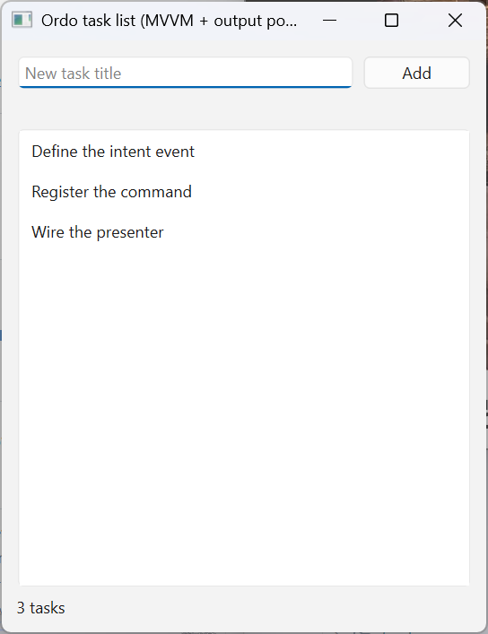

**Sequence**

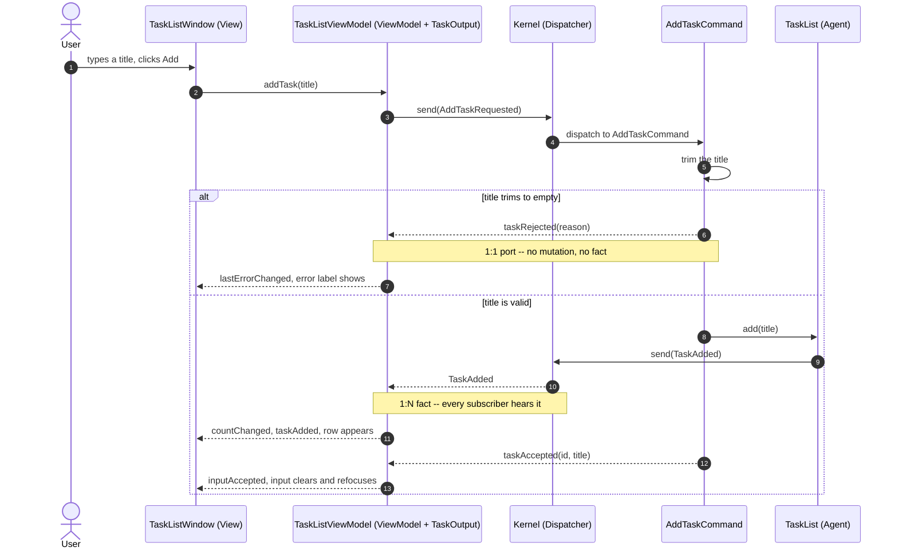

**Read more**

- [README](../examples/task-list-mvvm/README.md)
- [`model/task_commands.cpp`](../examples/task-list-mvvm/model/task_commands.cpp) -- both channels in twenty lines
- [`viewmodel/task_list_view_model.h`](../examples/task-list-mvvm/viewmodel/task_list_view_model.h) -- port implementation and fact handler side by side

---

## task-list-mvvm-qml

[`../examples/task-list-mvvm-qml/`](../examples/task-list-mvvm-qml/)

**Purpose**

- The same domain loop as the widgets sibling -- same events, agent, add
  command, output port -- behind a declarative QML view, plus toggle and remove
  so the list has update and erase paths too.
- Answers the "where is the Controller?" question for Qt: Qt folds it into the
  view, and ordo fills the empty seat with commands, agents, and typed events.

**What it demonstrates**

- A **projection ViewModel**: a `QObject` exposing `items` (a row model with
  `title` / `done` / `taskId` roles), `lastError`, three `Q_INVOKABLE` intents,
  and an `inputAccepted` signal.
- Strictly one-way projection: the only writers of the row model are the three
  fact handlers. QML never writes a row -- the checkbox uses a `Binding on
  checked`, so a click cannot sever the binding and show a state the domain
  never agreed to.
- Which intents need a result port and which do not: add validates free human
  text and uses the port; toggle and remove stay broadcast-only, because their
  ids can only have come from a fact the view already received.

**Scenario**

Add a task -- empty input surfaces the error label, a valid one appears in the
`ListView`. Tick a row and the checkmark moves only once the fact comes back.
Remove a row and it leaves the projection.

**Sequence**

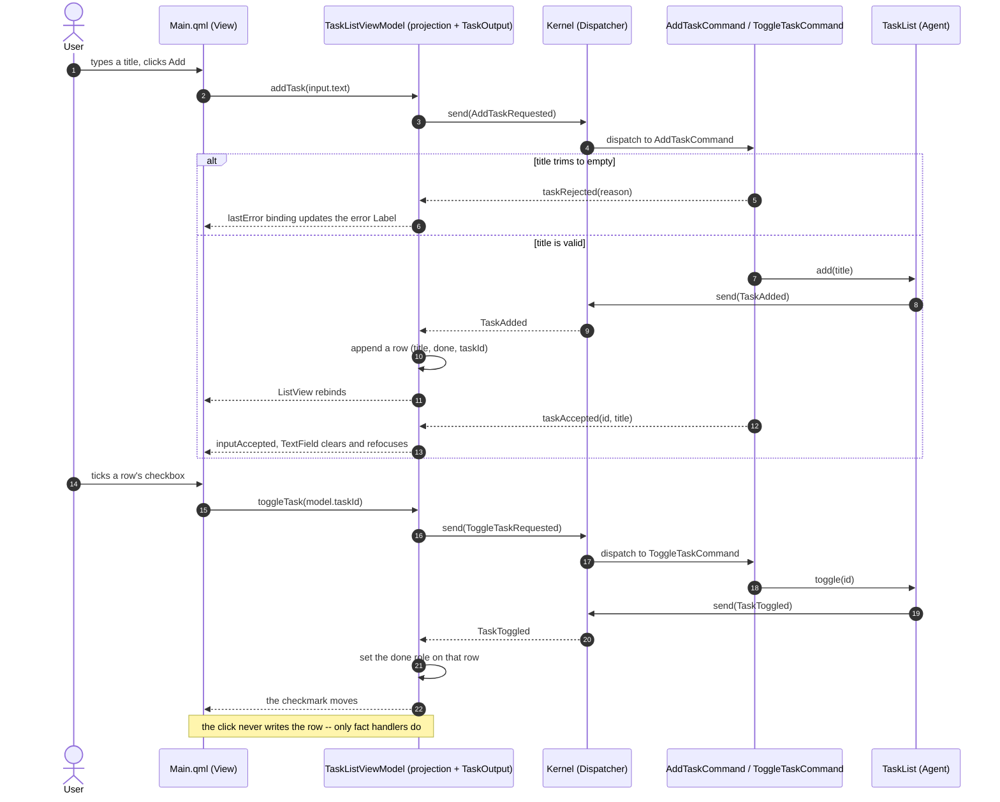

**Read more**

- [README](../examples/task-list-mvvm-qml/README.md) -- the missing-Controller and `QStandardItemModel` sections
- [`viewmodel/task_list_view_model.h`](../examples/task-list-mvvm-qml/viewmodel/task_list_view_model.h) -- the projection, the invokables, the port
- [`view/Main.qml`](../examples/task-list-mvvm-qml/view/Main.qml) -- bindings and invokable calls, nothing else

---

## task-list-clean

[`../examples/task-list-clean/`](../examples/task-list-clean/)

**Purpose**

- The same feature laid out with Clean Architecture's vocabulary on disk:
  `entities/`, `use_cases/`, `interface_adapters/`.
- Swaps the adapter layer for an imperative `Presenter`, so both Qt-side roles
  ordo ships can be compared over an identical domain loop. One way to organize
  an ordo app, not a claim that ordo implements Clean Architecture.

**What it demonstrates**

- A **ports-and-adapters shape** mapped back to ordo roles: entity = `Agent`,
  interactor = `Command`, output port = an interface the command receives at
  registration, presenter = the adapter implementing it.
- Why there is no input-port *file*: the typed event **is** the input port and
  `registerCommand` is the binding, so `AddTaskRequest` doubles as request model
  and intent event instead of wrapping a POD in a POD.
- Presenter vs ViewModel, concretely: this presenter holds raw widget pointers
  and writes them in every callback, where the twin's view-model only raises
  signals.
- The registration lifetime rule: `main` drops the command registration before
  returning, so the stored port reference never outlives the presenter.

**Scenario**

User-visible behavior is identical to `task-list-mvvm`. What changed is
underneath: a presenter pokes the widgets instead of a view-model publishing
state for them to bind to.

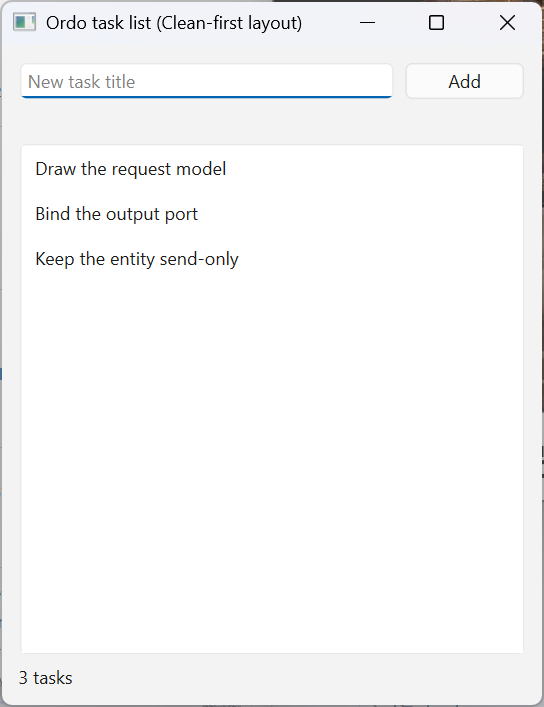

**Sequence**

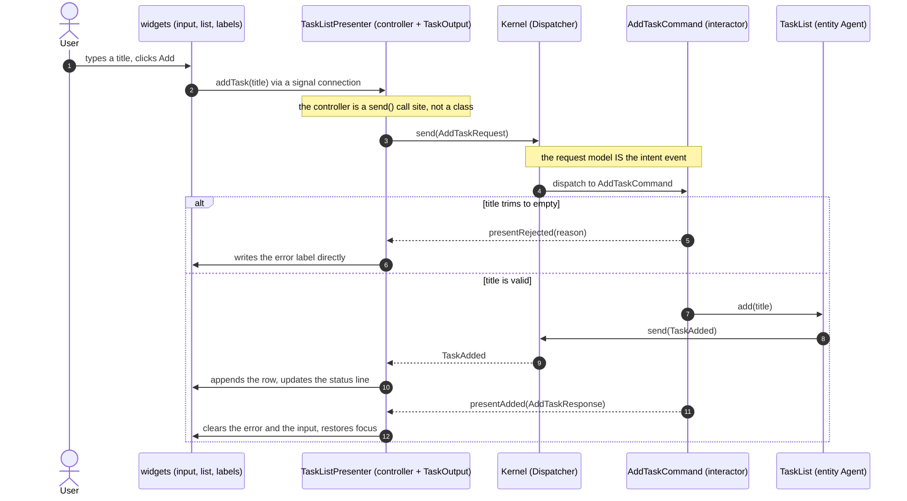

**Read more**

- [README](../examples/task-list-clean/README.md) -- the full Clean-to-ordo mapping table
- [`use_cases/add_task_command.h`](../examples/task-list-clean/use_cases/add_task_command.h) -- the interactor and both channels
- [`interface_adapters/task_list_presenter.cpp`](../examples/task-list-clean/interface_adapters/task_list_presenter.cpp) -- imperative widget writes

---

## todomvc

[`../examples/todomvc/`](../examples/todomvc/)

**Purpose**

- The classic [TodoMVC](https://todomvc.com/) feature set on ordo: add, toggle,
  destroy, edit (edit-to-empty destroys), All/Active/Completed filters, an
  items-left counter, clear-completed, toggle-all.
- Grows the vocabulary from one intent to seven, each with its own typed command.
- Adds a **write-through persistence lane**: todos survive a restart, and every
  touch of the database runs on one dedicated worker thread.

**What it demonstrates**

- Seven per-intent commands instead of one command switching on a name -- typed
  events leave nothing to switch on -- with events and commands grouped by
  feature lane, never by kind.
- **Memory-authoritative write-through.** Each mutating command mutates the
  agent first, enqueues the mirroring database op second, notes the pending
  write third. The view never waits on a write.
- A **serial I/O lane**: one thread, one connection, everything queued, so
  mutation order survives the trip to disk with no sequence numbers -- the
  deliberate contrast with mesh-farm's parallel pool.
- The relay seam in its simplest form: `DbRelay` posts replies back onto the UI
  thread, where they re-enter as ordinary events (`TodosLoaded`,
  `PersistCompleted`).

**Scenario**

The window opens under a busy overlay while the table loads off the UI thread;
the overlay lifts on the first load result, success or failure alike. A label
beside the items-left count reads "saving" while writes are in flight and
"saved" once they drain, with a red label only if the last write failed. Restart
and the todos are still there.

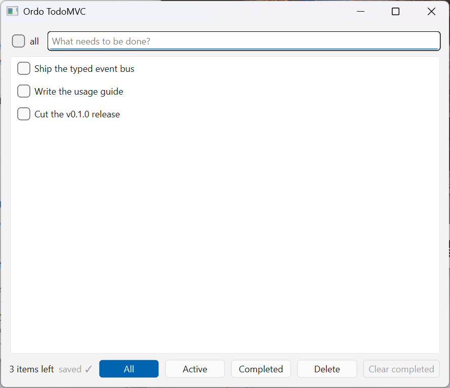

**Sequence**

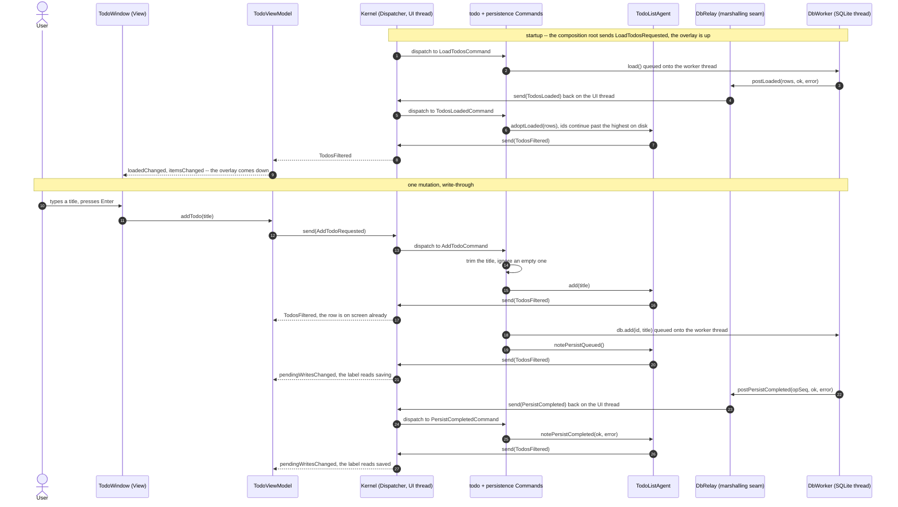

**Read more**

- [README](../examples/todomvc/README.md) -- the serial I/O lane, the schema, the loading overlay, the smoke check
- [`controller/todo_commands.h`](../examples/todomvc/controller/todo_commands.h) -- the seven intent commands and where the database ops are issued
- [`infra/db_worker.h`](../examples/todomvc/infra/db_worker.h) -- `DbRelay` plus the thread that owns the connection

---

## mesh-farm

[`../examples/mesh-farm/`](../examples/mesh-farm/)

**Purpose**

- A pool of worker threads bakes procedural 3D parts through a plain C-API DLL
  while a `QOpenGLWidget` shelf assembles the results live.
- Shows thread discipline around a GPU-backed view: the GL context and the
  dispatcher both belong to the UI thread, every worker result crosses back
  through exactly one seam, and there is no lock anywhere.

**What it demonstrates**

- The **worker relay seam**. `BakeRelay::postStarted` / `postProgress` /
  `postFinished` are the only worker-to-UI crossing; on the far side they
  re-enter the kernel as `BakeJobStarted` / `BakeJobProgress` /
  `BakeJobFinished`, and three thin commands forward them into the agent. Past
  the relay, nothing is threaded any more.
- **Generation staleness, two guards, two failure windows.** A stale-*start*
  check inside the runnable skips a superseded job before it bakes; a
  stale-*arrival* check drops results that landed too late and counts them in
  the status row. Stale *progress* is dropped silently -- in-flight checkpoints
  are not completed work.
- **Facts stay light.** `ShelfChanged` carries statuses, workers, and counts,
  never geometry; the presenter pulls the buffers it needs off the live agent.
- Deferred GL work: `paintGL` drains pending uploads and releases once per
  frame, the one place the context is guaranteed current.

**Scenario**

Set seed, part count, and AO rays, then press Regenerate. Parts appear ghost-gray
the instant their geometry exists and shade in as the bake sweeps them, while
worker lanes light up green and name the part they are on. Orbit and zoom stay
live throughout. Press Regenerate mid-batch and the board is replaced -- late
results from the old batch are counted stale, never shown.

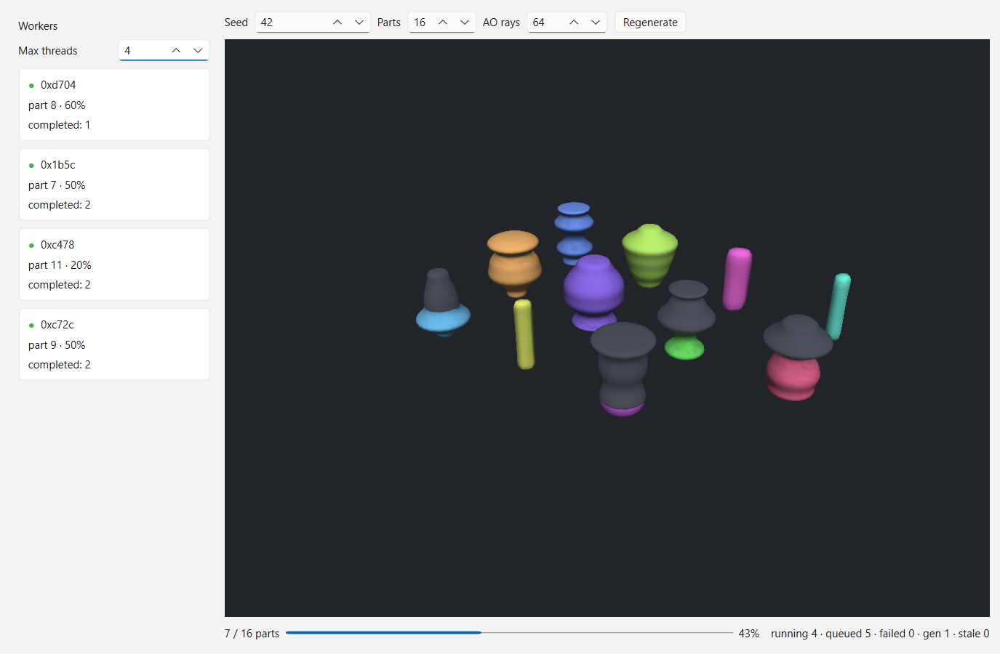
*Mid-bake: ghost-gray parts shade in as the AO sweep reaches them; four worker lanes busy, five parts still queued.*

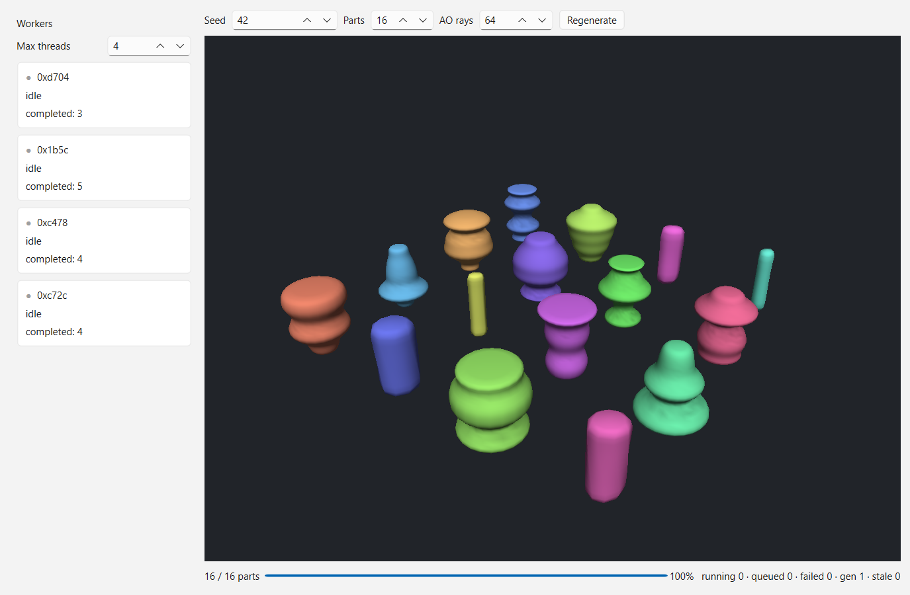
*Batch complete: 16/16 baked, every lane idle.*

**Sequence**

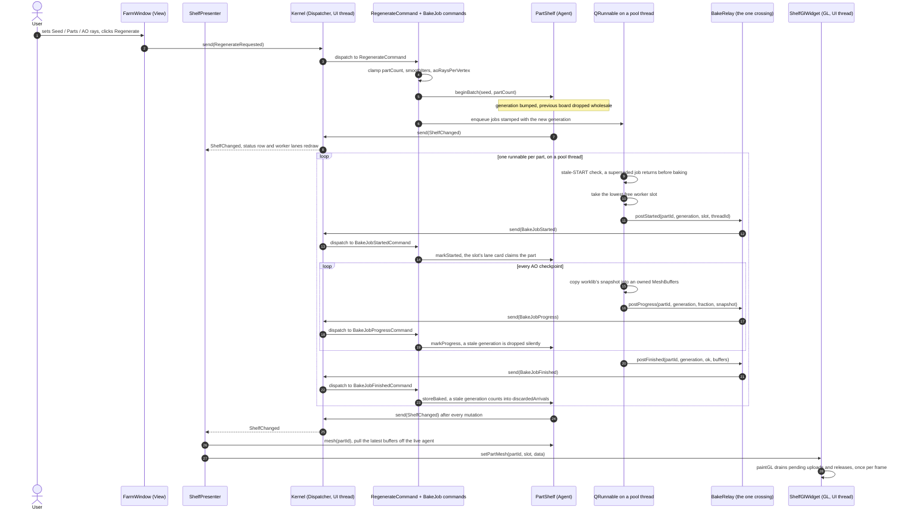

**Read more**

- [README](../examples/mesh-farm/README.md) -- the loop end to end, the two stale guards, the worker panel, the rejected alternatives
- [`infra/job_runner.h`](../examples/mesh-farm/infra/job_runner.h) -- `BakeRelay` and the progress thunk
- [`domain/part_shelf.h`](../examples/mesh-farm/domain/part_shelf.h) -- generations, the stale-arrival guard, the light fact

---

## galaxy-farm

[`../examples/galaxy-farm/`](../examples/galaxy-farm/)

**Purpose**

- The same relay seam at a larger scale: worker threads build procedural star
  fields through a C-API DLL while a `QOpenGLWidget` viewport shows the
  destination sector filling in galaxy by galaxy.
- Turns mesh-farm's single-batch shape into an "infinite universe" loop -- the
  agent owns **two** boards, so "here" keeps existing while "where I am going"
  builds ahead of it, and re-jumping mid-transit becomes a designed, legal
  action: the stale path this example exists to prove.

**What it demonstrates**

- The identical seam under different names: `GenRelay`'s three posts re-enter as
  `GalaxyJobStarted` / `GalaxyJobProgress` / `GalaxyJobFinished`, forwarded by
  three thin commands into `StarMap`.
- **Epoch staleness over two boards.** `JumpRequested` bumps the epoch and clears
  the destination; the stale-start, stale-arrival, and silent-stale-progress
  guards behave exactly as mesh-farm's, one level up.
- Where a clock belongs: the domain is timer-free, so the ~4s transit lives in
  `JumpPresenter`, which sends `JumpArrivalReached` itself when the elapsed time
  crosses the threshold. A re-jump restarts that clock rather than queuing.
- The one rule that is *not* staleness: arrival promotes the destination board to
  current **without** bumping the epoch, so a galaxy still generating for that
  sector keeps streaming into what is now the current board. Only a fresh jump
  invalidates in-flight results.

**Scenario**

Set the universe seed, galaxies per sector, and stars per galaxy, then press
Jump. The streak tunnel opens, the destination's galaxies appear and densify as
their clouds stream in, and arrival snaps the view back to idle with the
destination now current. Press Jump again mid-transit and the tunnel restarts on
a new epoch -- the abandoned sector's late results are counted stale and never
shown. Orbit and zoom stay live the entire time.

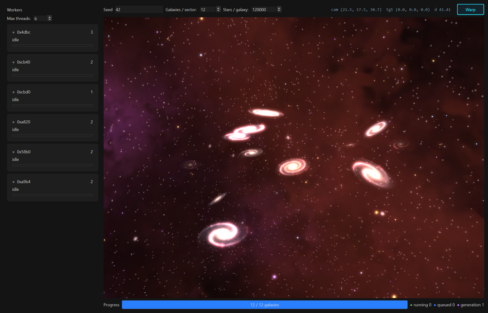
*Idle over the current sector: 12 generated galaxies against the baked sky, worker lanes drained.*

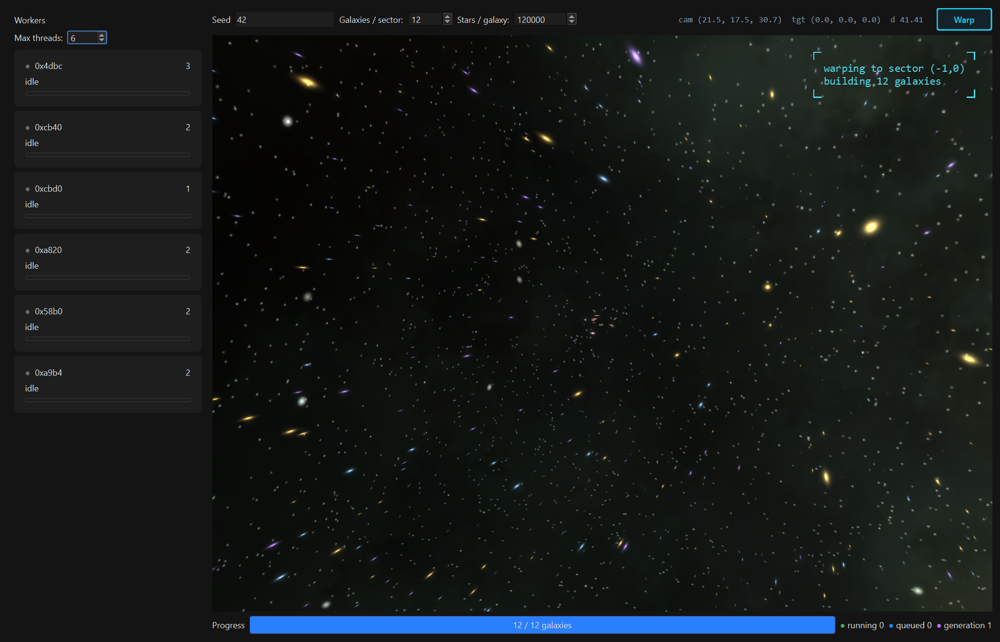
*Mid-transit: the HUD names the destination sector while its galaxies build.*

**Sequence**

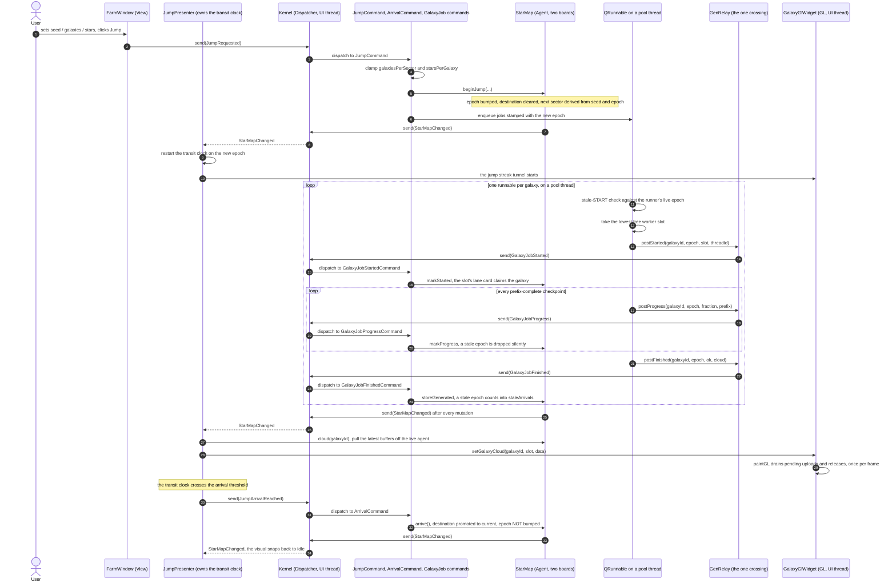

**Read more**

- [README](../examples/galaxy-farm/README.md) -- epochs and stale sectors, the transit clock, the DLL contract, the dev probes
- [`domain/star_map.h`](../examples/galaxy-farm/domain/star_map.h) -- the two boards, the epoch, the stale-arrival guard
- [`docs/examples/galaxy-farm/algorithms.md`](examples/galaxy-farm/algorithms.md) -- the rendering algorithms, kept out of the ordo story

---

## Learning path

Read them in order and each one adds exactly one thing:

- **[task-list-mvvm](../examples/task-list-mvvm/)** establishes the loop --
  intent, command, agent, fact -- and the rule that pays off everywhere after
  it: a command has *two* result channels, a 1:1 port for whoever asked and a
  1:N fact for everyone watching.
- **[task-list-mvvm-qml](../examples/task-list-mvvm-qml/)** keeps that domain
  loop and changes only the view adapter, so the projection ViewModel stands out
  as a view-side concern: a row model written solely by fact handlers, with the
  declarative view binding to it and never writing back.
- **[task-list-clean](../examples/task-list-clean/)** re-lays the same feature in
  ports-and-adapters vocabulary and swaps the ViewModel for a Presenter, showing
  which pieces ordo already gives you (the typed event is the input port) and
  which are yours to write.
- **[todomvc](../examples/todomvc/)** scales the vocabulary to seven typed
  commands, then adds a second feature lane: write-through persistence on a
  dedicated worker thread, with a relay bringing its replies back into the loop
  as ordinary events.
- **[mesh-farm](../examples/mesh-farm/)** takes that seam to a thread *pool* and
  a GL view. Parallel, unordered completion is the point, which is what forces
  generation stamps, two stale guards, and light facts with the heavy data left
  on the agent.
- **[galaxy-farm](../examples/galaxy-farm/)** runs the same seam at full scale
  and makes supersession routine: two boards, epochs instead of generations, a
  view-owned transit clock, and an arrival that promotes a board *without*
  invalidating the work still streaming into it.

The first three share one feature and differ only above the event bus; todomvc
adds the first real seam, one dedicated I/O thread; mesh-farm and
galaxy-farm each add a worker-pool seam -- unordered completion first, then
supersession made routine -- without introducing a single mechanism the first
four did not already teach.
